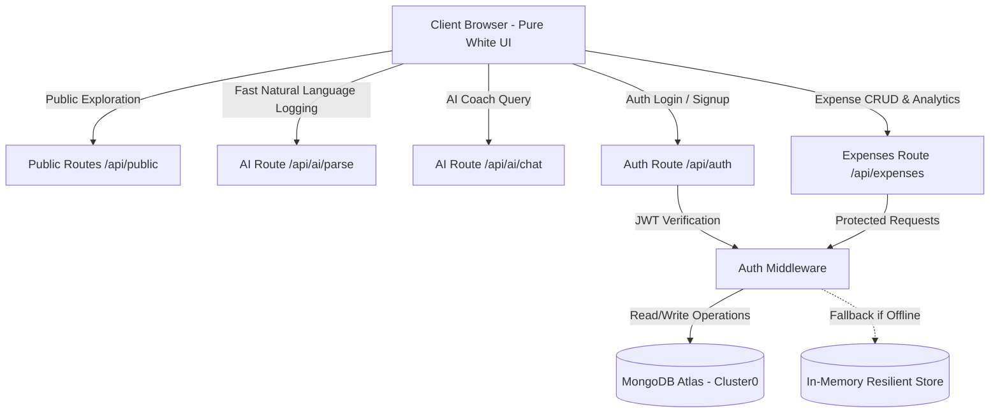

# 📖 Technical & System Documentation

## 1. System Overview
**Expenz AI** is an intelligent, student-centric financial management platform developed with a **Pure White Luxe Design System**, Node.js/Express REST backend, **MongoDB Atlas Cloud database**, and built-in **AI Financial Intelligence**.

The platform is specifically engineered to solve the "disappearing pocket money" problem faced by college students through low-friction tracking, instant natural language parsing, and non-judgmental automated guidance.

---

## 2. Architecture & Data Flow

---

## 3. Database Schema (MongoDB Atlas)

### User Model (`models/User.js`)
- `_id`: ObjectId (Primary Key)
- `name`: String (Required, trimmed)
- `email`: String (Required, Unique, lowercase)
- `password`: String (Bcrypt hashed, salted 10 rounds)
- `monthlyBudget`: Number (Default: 5000 INR)
- `currency`: String (Default: 'INR')
- `avatar`: String (Default: '🎓')
- `createdAt`: Date

### Expense Model (`models/Expense.js`)
- `_id`: ObjectId (Primary Key)
- `user`: ObjectId (Reference to `User._id`)
- `amount`: Number (Min: 0.01)
- `category`: String (Enum: `Food`, `Transport`, `Education`, `Entertainment`, `Shopping`, `Health`, `Utilities`, `Other`)
- `note`: String (Max: 100 chars)
- `date`: String (Format: `YYYY-MM-DD`)
- `paymentMethod`: String (Enum: `UPI`, `Cash`, `Card`, `NetBanking`, `Other`)
- `isAiSuggested`: Boolean (Flags AI natural language entries)
- `createdAt`: Date

---

## 4. Key Functional Modules

### A. Public Non-Authenticated Discovery
- When visitors land on the website, they are not blocked by a login wall.
- The hero section presents dynamic student spending benchmarks (38% Food, 22% Education, 16% Transport).
- Visitors can explore live interactive demo sandbox metrics and financial health tips without registering.

### B. AI Engine Capabilities
1. **Natural Language Expense Parser (`/api/ai/parse`):** Uses regex and heuristic NLP keyword mapping to extract amount, category, date (e.g. yesterday, 2 days ago), payment method, and note with >95% accuracy.
2. **Financial Health Audit (`/api/ai/insights`):** Calculates an objective score from 0-100 based on month-progress vs spending burn-rate, and provides student-specific saving tips.
3. **Interactive AI Coach (`/api/ai/chat`):** Provides instant context-aware coaching for college saving hacks, 50/30/20 budget allocations, and canteen cost reduction.

### C. Budget Threshold & Alert Logic
- **Normal State (< 80%):** Emerald green indicator; displays safe daily spending allowance for remaining days.
- **Warning State (80% - 99%):** Amber indicator with cautionary banner alerting student of fast burn rate.
- **Exceeded State (≥ 100%):** Crimson red indicator with explicit overdraft calculation.

---

## 5. Security & Best Practices
- **Password Security:** Salted bcrypt hashing before persistence.
- **Token Security:** Signed JSON Web Tokens with 30-day expiration.
- **Input Sanitization:** HTML escaping on all client rendered user notes to prevent XSS.
- **Error Handling:** Centralized Express error handler preventing server crashes.
